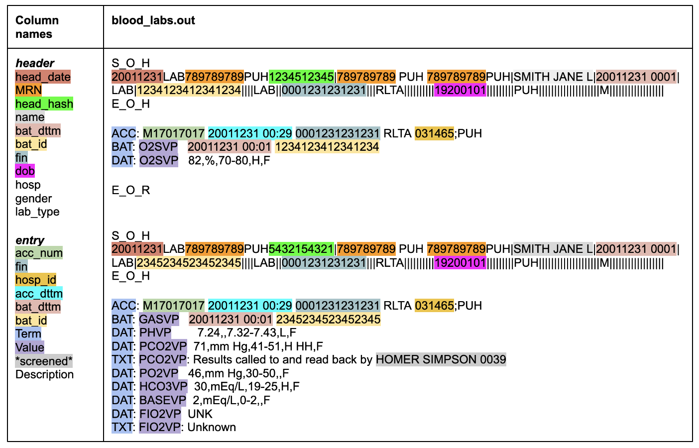
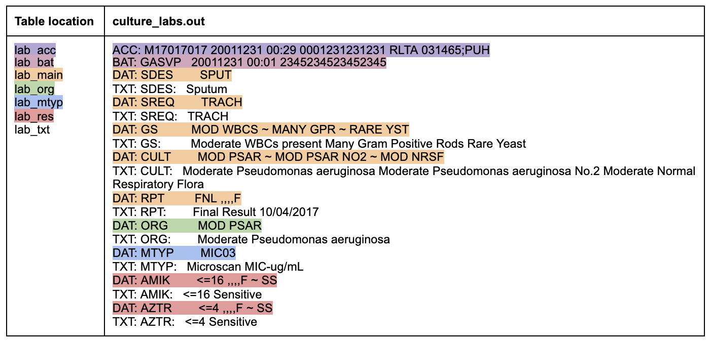

```{r, include = FALSE}
knitr::opts_chunk$set(
  collapse = TRUE,
  comment = "#>"
)
```

Given a set of medical record numbers (MRNs on newlines in a `file.who`) and a bar-formated extraction query (`file.esp`) pointing to labs or microcultures, MARS will return this:





## Create Project

The first step for setting up the processing pipeline is organizing these files into a directory structure. This will be raw `files.out` in subfolders that correspond to their source in MARS. This includes blood labs (`lb`), microcultures (`lc`), demographics (`mpax`), charges (`charges`), International Classification of Diseases (`icd`).

```{r setup}
library(marsrap)
library(dplyr)
library(arrow)

create_project(copy_files = TRUE)
list.files("raw", full.names = TRUE, recursive = TRUE)
```

## Parse headers and bodies

The the next step uses a `parse.sh` file to concatenate headers, accession info, battery info, and bodies and deposit them into another folder.

```{r eval=TRUE}
parse_out("raw")
list.files("prepped")
```

## Clean

After source files are parsed into coherent files, uniform column names, types, and removals are applied. The results can be saved to `.csv` or `.arrow`. The latter is necessary for large cohorts.

```{r eval=TRUE}
clean_dir("prepped")
```

## Annotate

MARS relies on line order to structure files. To convert to tidy data, we first annotate implicit groupings due to order. We can then organize into "entries", "reports", and for microcultures, "organisms" and "micro type" or `MTYP`.

```{r}
anno_group("data/body.arrow")

open_dataset("data/anno_body.arrow", format = "arrow") |> 
  collect()
```

## De-identify

The general approach here is to assign a new ID and date-shift amount to a patient, and scrub the data of anything that could reveal identifying information. For more info, see [HHS](https://www.hhs.gov/hipaa/for-professionals/privacy/special-topics/de-identification/index.html).

By default, a `crosswalk.arrow` (should prob be a .csv) is created when the header is de-identified. This is a map from new IDs to old IDS, and allows the data manager to re-identify the patients when handling validation issues, if need be. It is also sourced in the downstream de-id routine to ensure that the same date shifts and ids are used.

New IDs should

1.  be unique
2.  derive from something permanent and unique about a patient, e.g. SSN or Medical Record Number (MRN), but not a name.
3.  come from a hash, i.e. the MRN cannot be recovered
4.  have salt, i.e. make the new IDs unique to a project, such that the same patients in another study could not be cross-referenced.

Date-shifts should

1.  be uniform across the range, eg. equal chance of 1-365 days
2.  apply to all dates for a patient, eg. getting age from birthday and visit day should still work.
3.  derive from something permanent and unique about a patient, e.g. SSN or Medical Record Number (MRN), but not a name.
4.  come from a hash, i.e. the MRN cannot be guessed
5.  have salt


```{r}
head <- deid_head("data/head.arrow")
acc <- deid_acc("data/acc.arrow", crosswalk = "data/crosswalk.arrow")
bat <- deid_bat("data/bat.arrow", crosswalk = "data/crosswalk.arrow")
lab <- deid_body("data/anno_body.arrow", "data/crosswalk.arrow", type = "lab") 

head
acc
bat
lab
```

### Labs

The special case is `lab`, which has much more processing and a complex output. 

```{r}
lab
```

In what follows, we review the steps.

#### Meta

Many things can be IDs (identifiers). In particular, internal record numbers

1.  Social security numbers
2.  Medical record numbers
3.  Accession Numbers (eg. F1234432)
4.  Accession IDs (13-digit)
5.  Battery IDs (16-digit)
6.  Billing numbers ("FINs")


#### Text

One step remains for de-identification. Notice that the `Description` may contain PHI.

Text is the worst, because there are relatively few restrictions on the content.

```{r}
result <- marsrap:::deid_lab_body_meta("data/anno_body.arrow", crosswalk = "data/crosswalk.arrow")

result |> 
  filter(Value == "PCO2VP") |> 
  select(Description)
```

We have endeavored to include all possible patterns for free-text PHI like this. We err on the side of caution.

```{r}
deid_result <- deid_lab_body_data(result)

deid_result |> 
  filter(Value == "PCO2VP") |> 
  select(Description)

```


## Reshape

Next we recover a wide metadata rich format from the long line-order format from MARS. Here we use the annotations applied before to nest units within each other:

For microcultures: 

- microbiology assays within orgnaisms, 
- sets of organisms within reports 
- reports within patients.

For bloodlabs: 

- panel and optional report within patient

Up to now, the format of the output has been

-   relatively standard
-   saved incrementally
-   relatively quick to process

The remaining steps will take longer, result in differently shaped outputs, and only the final form saved.

### Culture labs

From the old PaDB docs

> Whereas the blood labs usually lack rpt and org substructure, we have the following substructure:
>
> 1.  Except in degenerate cases, there is one report per entry.
> 2.  Most culture labs comes as a report without an organism.
> 3.  In about 15k entries out of 205K, there is an organism.
> 4.  About 8k entries have one organism, half of this have 2 organisms, and so on.
>
> So we can exclude culture labs with more or less than 1 report.
>
> And we should subdivide reports into those with and without organisms.

With more understanding, the ratio here seems to be the difference between identification protocols (the vast majority) and then the sensitivity testing that sometimes comes after this. So all cultures have an organism, but sometimes this is recorded in the ORG Description and sometimes in the CULT position. The ORG is the first position of the CULT it seems.

```{r}
lc_reshape_result <- 
  deid_result |> 
  reshape_lc()

lc_reshape_result

```

In the records without sensitivity testing, we can note a few things:

1. `acc_id_h` indicates a hospitalization.
1. `acc_num_h` indicates each lab result requested
1. `bat_id_h` indicates each time that lab result changes status
1. `SDES` is the source tissue
1. `CULT` is the organism tested for (note that here it is "find what you look for")
1. `CULT` tells a story. `PENDING`, `NMRS1`, `NMRS2` no MRSA day 1, day 2, final. 

```{r include=FALSE, eval=FALSE}
deid_result |> 
  count(src)
```


### Blood labs


`_idd` variables tell us whether a battery has more complex structure that we need to take account of. For blood labs, those are:

1. `RPT`: rarely a report has many subsequent lines of text that contain data. In the blood labs data set, this is only when labs come from `QST` and `RFP` (Quest and some other external lab?). In the culture labs, this most data has report structure.
2. `ORG`: although organism results should be in the culture labs only, they still sometimes appear in the blood labs.

For blood labs, we entries with positive indicators are erroneous and will thus be handled separately. In the sample data, we deal only with comformant data.


```{r}
lb_reshape_result <- 
  deid_result |> 
  reshape_lb()

lb_reshape_result |> names()

lb_raw <- lb_reshape_result$base

```

#### Delimiters and Values

The main data is in the "Description" field. We have a few different kinds of data here. The MARS system uses different organizational schemes for each, and picks a delimiter for each. So it is helpful to subdivide by delimiter.

MARS has a hierarchy of delimiters. Also characters with special meaning.


1. `~` *
1. `;`: 
1. `,`: 
1. ` `:
1. `-`:

* I think? if culture with sens testing, like an annotation

However, it is very challenging to decompose in this manner. Moveover, the main interest is with the leading characters.  Until a better strategy is developed, we will leave part of the labs unprocessed. 

1. `;`:
1. `;`:

1. `@`:


```{r}

lb <-
  lb_raw |> 
  parse_lb_base()

lb
```


## Marts

Technically and finally, we are done. But the record metadata is not helpfully arranged. In particular, the date, time and location information is not with the lab value results or the lab value type. We have to use the IDs to join them.


```{r fig.width=8, fig.height=6}

test_mart_lb <- 
  mart_lb(lab$lb, acc, bat, head$head)

test_mart_lb |> 
  head(10) |> 
  knitr::kable()
  

  
```


```{r include=FALSE}
cleanup()
```
